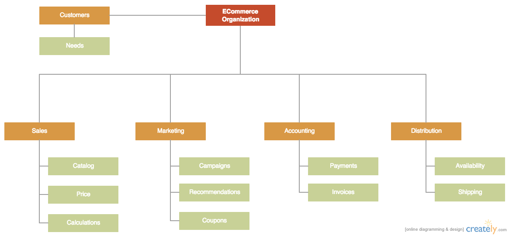
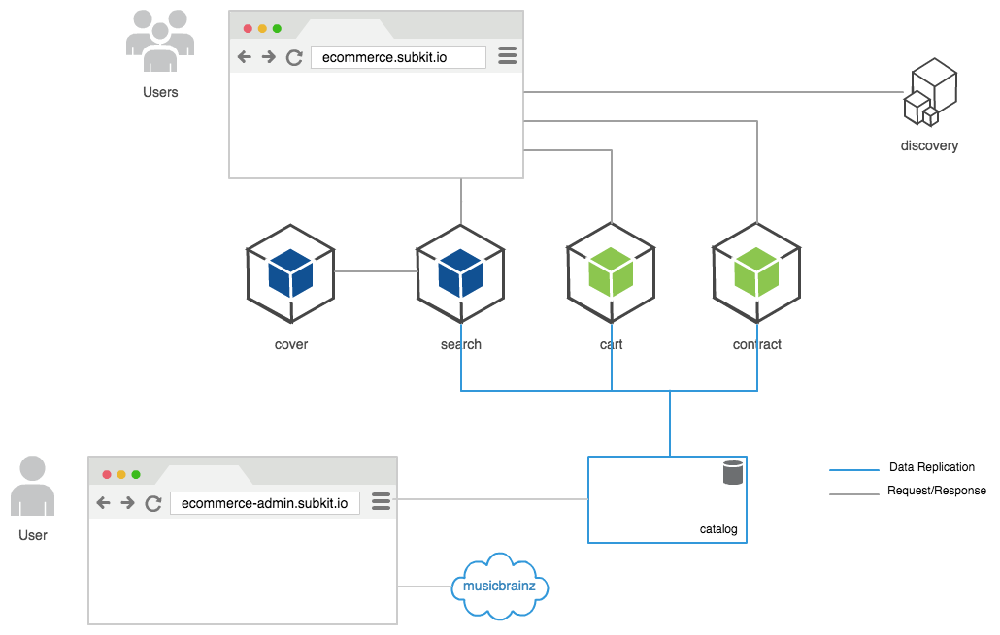

#Analyse, Design & Architektur

##Ziele

Auch wenn wir uns über die Entwicklung neuer Anwendungen von der "grünen Wiese" weg freuen, so wenig ist der Begriff aus Sicht der Unternehmung passend. In den meisten Organisationen existieren vorhandene oder gewünschte Strukturen. Mit zunehmender von innen oder außen gewünschter organisatorischer Dynamik ändern sich stetig Wünsche, Struktur, Organisationskommunikation oder Zuständigkeiten. Das Problem ist somit weniger die heutig bekannte Struktur, sondern die Fähigkeit auf morgige Anforderungen schnell, kostengünstig und verlässlich zu reagieren. 

##Analyse und Entwurf

Mit Microservice-Architekturen sollen Anwendungen entstehen, die dynamische Geschäftsmodelle unterstützen und Anforderungen von morgen leicht und flexibel technisch unterstützen. Dabei liegt der Schlüssel einer effizienten Anforderungsanalyse im Zerlegen von großen Aufgaben in kleinere Aufgaben. In den meisten Fällen spiegeln Organisationen diese Art der Aufgabenverteilung bzw. Zuständigkeiten und es etablieren sich mehr oder minder starre Kommunikationsstrukturen und Prozesse zwischen ihnen. 

Oft ist der Blick auf die vorhandene oder gewünschte Organisationstruktur, dessen Kommunikation und Prozesse ein gutes Mittel das Bild auf die Architektur zu schärfen. Ein erster Entwurf sollte sich somit auf die unterschiedlichen Rollen bzw. Abteilungen und dessen spezifische Domäne (DDD auch Bounded Context genannt) und Begriffe auseinandersetzen. In der genaueren Analyse einer spezifischen Domäne sollten Sie Zuständigkeiten, Begriffe, Prozesse und die Kommunikation im innerin und nach außen erarbeiten. Nicht sellten können Sie innerhalb einer Domäne abermals Teilaufgaben erkennen. Die meist vorhandene, technisch neutrale hierarchische Struktur von Aufgaben, Teilaufgaben und Teil-Teilaufgaben ist meist ein guter Anfang für einen ersten Architekturentwurf.

An dieser Stelle kann ich den interessierten Leser wärmstens Techniken und Praktiken aus [DDD](https://de.wikipedia.org/wiki/Domain-Driven_Design) empfehlen. 

Für unsere zukünftige Anwendung ergibt sich nach einer ersten Analyse folgendes Organigramm.

Abbildung 1

Wem es nicht gleich gelingt einen ersten Entwurf in angemessener Zeit aus der Vogelperspektive zu erarbeiten, kann sich auf einen Teilbereich konzentrieren. Ein Entwurf, wie der Begriff bereits prägt, hat keinesfalls den Anspruch auf Vollständigkeit. Vielmehr ist die Erarbeitung innerhalb eines angemessenen Zeitfensters entscheidend. Nacharbeit und möglicherweise verbundenes Refaktorieren sollte bewusst in Kauf genommen werden. Schrittweises Erarbeiten und Anpassung durch Erkenntnissen aus der Fachdomäne soll Sie und Ihre Kollegen vor bewussten oder unbewussten Annahmen, oder schlimmer Umsetzungen, schützen. 

##Architektur

Laut Wikipedia - „Strukturen eines Softwaresystems: Softwareteile, die Beziehungen zwischen diesen und die Eigenschaften der Softwareteile und ihrer Beziehungen“ [Paul Clements - Wikipedia](https://de.wikipedia.org/wiki/Softwarearchitektur) lehnt sich unsere erabeitete Architektur im ersten Entwurf an die Organisationsstruktur an.

Abbildung 2

##Anforderungen und Risikomanagement

So, oder so ähnlich, kann eine Teilanforderung aus Anwendersicht an die Gesamtanwendung beschrieben sein: 

Wie unsere Kunden unserer ECommerce-Organisation es gewohnt sind, ist ein 24/7 Betrieb mit 99,9% Gesamtverfügbarkeit gewünscht. Zudem muss eine stetige Weiterentwicklung und Veröffentlichung von Softwareteilen im laufenden Betrieb gewährleistet werden. Priorität, da Umsatzrelevant, hat der tatsächliche Kauf (verbindliche Bestellung) von Produkten des Warenkorbs.

Entscheidend ist, viele sonst vorborgende Annahmen, mögliche inhaltliche oder technische Fehler bzw. Probleme in Entwicklung und Betrieb von Anfang an explizit zu machen. Der Kompromiss aus technischem Aufwand und damit verbundene Kosten und der eigentlich Nutzen entsteht in der transparenten Kommunikation. D.h. vor der vermeidlich technisch perfekten Lösung, steht das Gespräch Ziele und Nutzen gegen Aufwände und Kosten an. Nach dem [Pareto-Prinzip](https://de.wikipedia.org/wiki/Paretoprinzip) ist ein "für den Anfang gut genug" nicht die perfekte aber weniger komplexe Entscheidung.

Wer vor sehr komplexen Teildomänen mit vielen fachlichen oder technischen Herausforderungen steht, sei hiermit empfohlen, auf ein "klassisches [Monolith First](http://martinfowler.com/bliki/MonolithFirst.html)" Architekturmodell zurückzugreifen. So können mehr über die Fachdomäne erfahren und die technischen Risiken minimieren.

##Umsetzung in Timeboxes

Die Umsetzung unserer ECommerce-Anwendung lässt bewusst einige Aspekte und gwünschte Funktionen in der tatsächlichen Umsetzung vorerst außen vor. Diese werden in zukünftigen Entwicklungsschritten, nach ersten Nutzungsanalysen und damit besserem Verständnis der Teildomänen, integriert. Vermeiden Sie die Planung und Umsetzung vieler "unreifer Baustellen" mit hohen fachlichen oder technischen Risiken und konzentrieren Sie sich auf die stabile Umsetzung der Kernfunktionen. 

In Anlehnung an die ermittelte Organisationstruktur (Abbildung1), unserem Know-How und der vorhandenen Resourcen haben wir uns im ersten Schritt für eine Umsetzung der Kernfunktionen nach (Abbildung 2) innerhalb eines Zeitfensters von 2 Wochen entschieden. Die völlig unabhängige und damit parallele stattfindene Entwicklung und Veröffentlichung von Funktionalität bei beinahe störungsfreiem Betrieb waren zusätzliche Gründe, die Gesamtanwendungen in 4 Teilbereiche und innerhalb der Teilbereiche in kleine spezialisierte Dienste (Microservices) zu teilen. 

* Catalog - Artikelverwaltung (CMS)
* Search - Aggregation und Indezierung von Produktdaten
* Cart - Berechnung von Preisen
* Contract - Bestellung von Artikeln 

Jeder Microservice wurde dabei so umgesetzt, dass dieser im Rahmen seines Normalbetriebs völlig unabhängig von anderen Diensten seine spezialisierte Dienstleistung anbieten können muss. Um die stetige Aktualisierung und Neustarts von Microservices zu ermöglichen, wird jeder Dienst im Betrieb durch mindestens 2 Prozesse ausgeführt. 

Der Betrieb mehrerer Prozesse (Ausfallsicherheit oder Workload) eines Dienst stellt uns vor besondere Entwicklungs- und Operative Herausforderungen. An dieser Stelle mag jeder inzwischen reflexartig an Load-Balancer oder Cluster denken. Doch diese haben sind im täglichen Betrieb mit mehreren unabhängigen Veröffentlichungen pro Tag meist als zu statisch erwiesen. Zudem sind diese komplex, erfordern meist Spezialwissen, ziehen Abhändigkeiten nach sich und bilden einen sogenannten "Single Point of Failure". Auch deshalb müssen wir uns im folgenden mit einigen wichtigen Aspekten einer verteilten Anwendung auseinander setzen. Darunter zählen.

* Prozesskonfiguration
* Minimierung von Abhängigkeiten durch Datenhoheit
* Zustandsverwaltung und Zustandsübertragung (Kommunikation)
* Service Discovery
* Fehlertoleranz
* Instrumentation und Monitoring
* Reporting-, Stamm- und historische Daten 
* DevOp und Infrastruktur