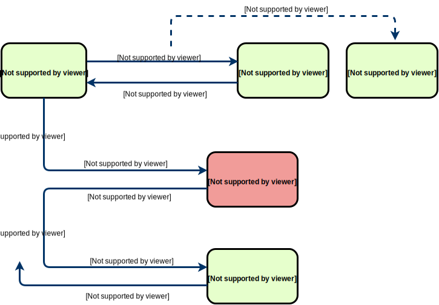

## Stabilität und Verfügbarkeit

In traditionellen serviceorientierten Architekturen wird die Kommunikation, sowohl zwischen Frontend und Backend als auch zwischen verschieden Diensten, meist über in Konfigurationsdateien hinterlegten Adressen realisiert. Diese enge Koppelung führt in der Praxis häufig zu Problemen bei der Weiterentwicklung der Systeme, z.B. wenn eine neue Version eines Dienstes veröffentlicht werden soll, welche nicht mehr abwärtskompatibel ist, während es jedoch noch weitere Dienste im System gibt, die von ersterem abhängen. Ebenso kann hier eine horizontale Skalierung nur durch vorgeschaltete Load Balancer oder direkt auf DNS-Ebene realisiert werden, was wiederum die Komplexität der zu pflegenden Infrastruktur erhöht. Verzichtet man auf solche Maßnahmen, setzt man gleichzeitig die Verfügbarkeit des Gesamtsystems aufs Spiel: In einem Netz aus voneinander abhängigen Diensten dürfte dann kein einziger dieser Dienste ausfallen.
Microservices verfolgen von ihrem Wesen her einen anderen Ansatz: Zum einen sind Dienste im Optimalfall völlig autark und haben so wenig wie möglich (im besten Fall keine) externe Abhängigkeiten, zum anderen sind sie derart gestaltet, dass sie selbst bei einem Ausfall dieser Abhängigkeiten völlig oder zumindest nur leicht eingeschränkt operabel bleiben. Ist der Partner-Dienst dann zu einem späteren Zeitpunkt wieder verfügbar, können noch anstehende Operationen abgeschlossen oder veraltete Daten auf den neuesten Stand gebracht werden. Daraus folgt, dass Kommunikation zwischen Diensten im Regelfall asynchron und nicht im Kontext einer Benutzerinteraktion stattfindet. Es folgt auch daraus, dass die Verfügbarkeit veralteter Daten als immer noch besser zu bewerten ist als die Nicht-Verfügbarkeit jeglicher Daten oder sogar das Auftreten eines Fehlerfalls, im Falle des eCommerce-Beispiels schon rein aus geschäftlichem Interesse: Jeder Auftrag ist kostbar, auch wenn er vielleicht momentan aufgrund eines technischen Ausfalls nicht sofort verarbeitet werden kann.
Für Microservice-Architekturen bietet sich eine Reihe von Maßnahmen zur Fehlerkompensation und Ausfallsicherheit an:

### Service Discovery und Fallbacks

Nehmen wir an, Service A möchte seinen eigenen Datenbestand aktualisieren und muss dazu Service B aufrufen. In diesem Fall ist es für Service A im Grunde irrelevant, wieviele Instanzen von Service B laufen, unter welchen Addressen sie erreichbar sind, und welche der laufenden Instanzen nun tatsächlich aufgerufen werden soll. Das einzige Interesse von Service A ist, eine HTTP-Verbindung zu einer intakten Instanz von Service B zu erlangen. Anstatt nun Service A über Konfigurationsdaten mit sämtlichen Zugangsinformationen zu Service B auszustatten, können diese Informationen auch zur Laufzeit ermittelt werden. Dazu benötigt man einen Dienst, der als Registry fungiert und Daten über sämtliche im System laufende Dienste anbietet. Von dieser Registrierungsstelle können nach Bedarf die aktuellen Adressen eines Dienstes anhand seines Namens erfragt werden. Die somit erlangte Liste von Adressen kann für eine bestimmte Zeit im Speicher vorgehalten werden. Möchte man nun eine Verbindung herstellen, probiert man die Adressen systematisch durch. Antwortet die Gegenstelle nicht, so wird versucht, eine Verbindung mit der nächsten Adresse aus der Liste herzustellen (siehe Abbildung A1). Diesen ersten naiven Ansatz kann man dann weiter ausbauen, z.B. durch den Einsatz eines Circuit Breakers oder des Round-Robin-Verfahrens. Eine beispielhafte Implementierung im Rahmen eines AngularJS-Services ist in Listing A1 dargestellt.

Abbildung A1



Listing A1

```js
function ajax(method, serviceName, path, value) {
  return getServiceUrls(serviceName).then(function (urls) {
    if (!urls.length) throw new Error('No endpoint configured for service ' + serviceName);

    // Map urls to a list of operations
    var funcs = urls.map(function (url) {
      return $http[method].bind($http, 'http://' + url + path, value, { timeout: config.timeout });
    });

    return invokeUntilResolved(funcs);
  });
}

function getServiceUrls(serviceName) {
  if (cache[serviceName]) return $q.when(cache[serviceName]);

  var funcs = config.discoveryServers.map(function (discoveryServer) {
    return $http.get.bind($http, discoveryServer + '/v1/catalog/service/' + serviceName);
  });

  return invokeUntilResolved(funcs).then(function (result) {
    var serviceUrls = result.data.map(function (itm) {
      return itm.Address + ':' + itm.ServicePort;
    });

    cache[serviceName] = serviceUrls;
    return serviceUrls;
  });
}

function invokeUntilResolved(funcs) {
  // Invoke functions that return promises sequentially
  // and return the first resolved promise.
  // Invoke the next function only when the return value
  // of the previous function is a rejected promise.
  return funcs.reduce(function (previous, next) {
    return previous.catch(next);
  }, $q.reject(new Error('No function specified')));
}
```

Die Funktion `ajax` holt zuerst vom Discovery-Service sämtliche verfügbaren URLs für den angegebenen Service-Namen und erzeugt daraus eine Liste von Funktionen, in denen jeweils der HTTP-Aufruf an die entsprechende URL initiiert wird. Die eigentliche Fallback-Logik besteht aus der Verkettung dieser Funktionen, wobei die nächste immer nur dann aufgerufen wird, wenn der vorherige Aufruf zu einem Fehler geführt hat. Dies lässt sich in JavaScript elegant durch die Verkettung von Promises implementieren und geschieht in der Funktion `invokeUntilResolved`. Die Funktion `getServiceUrls` funktioniert nach dem gleichen Muster, schließlich muss es auch vom Discovery-Dienst mehrere Instanzen geben. Zusätzlich werden die Antworten dieser Aufrufe noch in einem lokalen Cache abgelegt, um bei weiteren Anfragen mit demselben Dienstnamen die Liste nicht noch einmal anfordern zu müssen.
Das Auffinden und Auswählen von Services ist eine Querschnittsfunktionalität, die höchstwahrscheinlich unverändert in mehreren Diensten zum Einsatz kommen wird. Aus diesem Grunde bietet es sich an, diese Funktion durch ein importierbares SDK zentral für alle Teams zur Verfügung zu stellen, z.B. als NuGet-Package, NPM-Modul oder Bower-Paket.

### Orchestration

Beim Zusammenspiel verteilter Dienste stellt sich immer die Frage nach dem richtigen Schnitt der Funktionalitäten sowie nach dem Management gegenseitiger Abhängigkeiten. Einen Königsweg gibt es wohl nicht, jedoch kann eine Faustregel sein, die Integration soweit wie möglich nach "vorne" zu verlagern, im Idealfall direkt in die UI. Auf diese Weise kann ein allzu dichtes Netz an Abhängigkeiten vermieden werden, und die Eigenständigkeit von Backend-Diensten wird größtmöglich gewahrt. Zum Beispiel ist es unserer Meinung nach meist keine gute Idee, eine "Web-API" zur Verfügung zu stellen, in der verschiedene Funktionalitäten zusammenlaufen. Es ist hier zu bevorzugen, dass die UI selbst mit den einzelnen Diensten kommuniziert und dann deren Daten aggregiert darstellt. Dieses Vorgehen macht einzelne Komponenten meist viel leichter austauschbar. Es kann aber auch Argumente geben, die gegen eine Orchastration in der Benutzeroberfläche sprechen, z.B. wenn Dienste aus Sicherheitsgründen nicht direkt öffentlich angesprochen werden können. In unserem Beispiel sind der Produktkatalog, der Einkaufswagen sowie die Bestellannahme weitestgehend voneinander getrennt. In der Nutzeroberfläche werden Daten aus verschiedenen Bereichen komponentenorientiert angezeigt (hier z.B. in verschiedenen AngularJS-Direktiven). Kommen im Laufe der Zeit weitere Dienste hinzu (wie z.B. eine Wunschliste oder ein Couponsystem), können diese integriert werden, ohne die Funktionalität vorhandener Services zu beeinträchtigen. Ein weiterer Punkt spricht für die Orchstration in der Nutzeroberfläche: Dadurch, dass hier der eigentliche Kontrollfluss stattfindet, ist es einfacher zu gewährleisten, dass bei Schreiboperationen die Gesamtheit aller Daten an ihrem vorgesehenen Zielort ankommt. Denn die UI kann sämtliche benötigte Daten aggregieren und an den entsprechenden Dienst als Komplettpaket abliefern, sodass dieser sich nicht noch zusätzlich um weitere Daten bemühen muss, was ja wieder eine potenzielle Fehlerquelle wäre.

### Datenreplikation

In den meisten Fällen bestehen Dienste nicht nur aus Logik, sondern brauchen in irgendeiner Form auch Zugriff auf Daten, sei es, dass sie neue Daten in das System einspeisen, oder bereits vorhandene Daten weiterverarbeiten. In klassischen Architekturen gibt aus diesem Grund eine oder mehrere meist relationale Datenbanken, um die sich Services wie Planeten in einem Sonnensystem gruppieren. Die Herausforderungen, die sich dabei stellen, sind die Behandlung von Nebenläufigkeit, Skalierung und Ausfallsicherheit. Ist die Datenbank offline, "geht nichts mehr". Ebenso ist die Evolution des Datenschemas eine heikle Angelegenheit, betrifft doch eine Änderung meist auch alle abhängigen Komponenten, was Entwickler meist vor diesem Schritt zurückschrecken lässt. Ein solch starkes Abhängigkeitsgefüge ist Microservice-Architekturen nicht zuträglich, zur Autarkie eines Dienstes gehört hier auch die alleinige Hoheit über sämtliche benötigten Daten. Um diese zu erlangen, ist es sinvoll, eine lokale Kopie der Daten zu haben, sei es nur im Speicher, Dateisystem oder gar in einer lokalen Datenbank, die nur der jeweiligen Service-Instanz zugänglich ist. Es handelt sich dabei jedoch um temporäre Daten. Beim Herunterfahren des Dienstes oder der Veröffentlichung einer neuen Version sind diese verloren. Ebenso kann es sein, dass die Kopie der Daten nicht mehr dem aktuellen Stand der "Master-Daten" entspricht, falls sich diese in der Zwischenzeit geändert haben sollten. Dies erfordert ein Umdenken auf Seite der Entwickler verglichen mit dem zentralen Ansatz: Die Behandlung von Inkonsistenzen wird zum elementaren Bestandteil der Programmlogik. In unserem CD-Shop-Beispiel kommt etwa dem SearchService die Aufgabe zu, auf Anfrage die aktuell angebotenen Produkte herauszugeben. Dazu wird bei jedem Start des Dienstes eine Replikation des Produktkatalogs, hier eine als "Data-Warehouse" dienende CouchDB, im lokalen Speicher erstellt (siehe Listing A2). Gleichzeitig werden diese Produktdaten durch Aufrufe an den CoverService mit Bildinformationen angereichert. Sind die Daten irgendwann zu alt, kann ein erneuter Replikationsdurchlauf angestoßen werden. Alternativ dazu könnte der Service in bestimmten Intervallen eigenständig seinen Bestand aktualisieren. In Listing A2 wird zudem die gesamte Replikation in einer anonymen Funktion ausgeführt, welche im Fehlerfall in zeitlichen Abständen automatisch wiederholt wird. Hierzu benutzen wir das NuGet-Package [ReliabilityPatterns](https://www.nuget.org/packages/ReliabilityPatterns/).

Listing A2

```c#
private List<Doc> docs = new List<Doc>();
private CircuitBreaker breaker = new CircuitBreaker();
private string[] DISCOVERY_SERVICE_URLS = (Environment.GetEnvironmentVariable("DISCOVERY_SERVICE_URLS") ?? "").Split(',', ';');

public dynamic Replicate()
{            
    dynamic result = new { message = "" };

    try
    {
        breaker.ExecuteWithRetries(() => {
            var serviceClient = new ServiceClient(DISCOVERY_SERVICE_URLS);
            
            Console.WriteLine("Try to replicate from catalog service");
            var search = serviceClient.Get<Search>("couchdb", "/products/_all_docs?include_docs=true");
            if (search == null) throw new Exception();

            docs = search.Rows.Select(x => x.Doc).Select(x => { x.Id = x.MbId; return x; }).ToList() ?? new List<Doc>();

            docs.ForEach(doc => {
                Console.WriteLine("Try to get cover for MBID " + doc.MbId + " from cover service");
                var covers = serviceClient.Get<List<string>>("cover-service", "/images/" + doc.MbId);
                                        
                doc.Covers = covers ?? new List<string>(0);
            });

            result = new { message = docs.Count + " doc(s) replicated" };
            Console.WriteLine(result);
            docs.ForEach(Console.WriteLine);

        }, 3, TimeSpan.FromSeconds(2));

        return result;
    }
    catch (Exception error)
    {
        result = new { message = "Replication error", error = error.Message };
        Console.WriteLine(result);
        return result;
    }
}
```

Eine etwas andere Strategie verfolgt der CoverService. Dieser dient als Proxy zu einem externen Dienst, von dem URLs zu CD-Cover-Bildern abgefragt werden können. Die Informationen werden hier nicht komplett repliziert, sondern erst auf Anfrage geholt. Von da an wird dann bei Folgeanfragen eine im lokalen Cache vorgehaltene Version des Datensatzes zurückgegeben. Ist der externe Dienst nicht erreichbar oder liefert er keine verwertbaren Daten, so wird hier einfach ein Standardbild als Fallback verwendet, da die Informationen nicht geschäftskritisch sind: Der Benutzer ist immer noch in der Lage, die CD zu bestellen, auch wenn das Coverbild nicht angezeigt werden kann.
